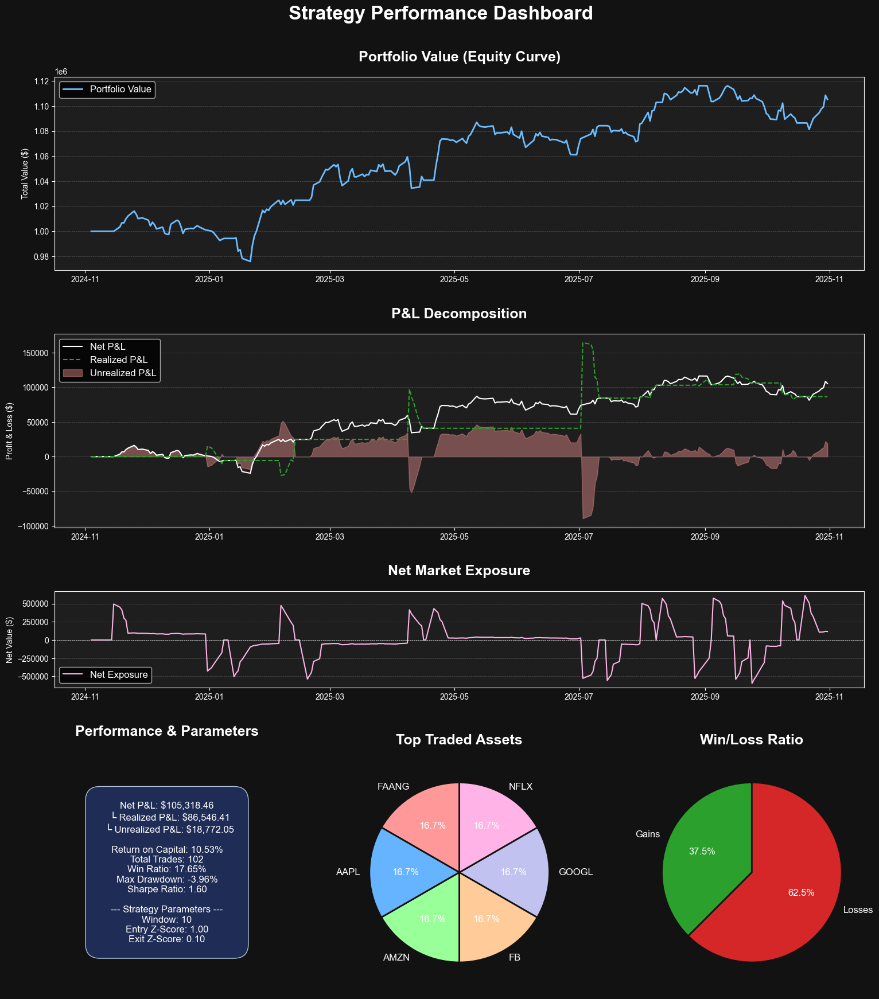

# Statistical Arbitrage (Pairs Trading) Backtester

This repository contains a complete, event-driven backtesting engine built from scratch in Python to simulate and optimize a quantitative pairs trading strategy.
The strategy models the mean-reverting behavior of the performance spread between the QQQ ETF and a synthetic, rebased basket of 5 large-cap tech stocks (AAPL, AMZN, META, GOOGL, NFLX).

### Final Optimized Strategy Performance
 
*(This dashboard shows the result of the optimal "hyper-reactive" parameter set)*

---
## Core Strategy & Methodology

The trading signal is a **rolling Z-Score** applied to the performance spread. This normalizes the spread, making it stationary and allowing for the identification of statistically significant deviations.

* **Entry:** A position is initiated when the Z-Score breaches the `entry_threshold`.
* **Exit:** The position is closed when the Z-Score reverts to its mean and crosses the `exit_threshold`.

Systematic parameter optimization was conducted to find the ideal parameters. The optimal configuration was found to be a "hyper-reactive" strategy (`Window=10`, `Entry=1.00`, `Exit=0.10`), which achieved the project's best risk-adjusted performance.

### Performance Analysis: The Optimal Configuration

This configuration is considered the best result because it demonstrates an exceptional and robust strategy:

* **A Sharpe Ratio of 1.60 is Exceptional:** Any ratio above 1.0 is considered efficient. A score of 1.60 indicates that the strategy generated an outstanding return for the minimal amount of risk it took.
* **Risk Was Extremely Well-Managed:** The most compelling metric is the **Max Drawdown of only -3.96%**. This is an incredibly low figure and proves the strategy's safety, as it never exposed the portfolio to significant capital loss.
* **A "Home Run" Profile:** The low Win Ratio (37.5%) is not a weakness but defines the strategy's profile. It acts as a "home run" strategy, successfully filtering out market noise to make many small, controlled (losing) bets to capture a few highly profitable reversions. The low drawdown proves these small losses were managed effectively.

---
## Technical Features

* **Custom Backtesting Engine:** Built entirely in **Python**, the engine handles sequential order execution (1 order/day), commission costs, and portfolio management.
* **Detailed P&L Tracking:** The engine precisely tracks and decomposes performance into `realized` and `unrealized` P&L, as well as `Net Market Exposure`.
* **Data Processing & Signal Generation:** Signal calculation and time-series analysis are handled efficiently using **Pandas** and **NumPy**.
* **Advanced Visualization:** A custom, multi-plot **Matplotlib** dashboard provides a comprehensive analysis of the equity curve, P&L decomposition, market exposure, and all key performance indicators (KPIs).

---
## How to Run

1.  **Clone the repository:**
    ```bash
    git clone [https://github.com/nadamousteau/Quant-Trading-Project.git](https://github.com/nadamousteau/Quant-Trading-Project.git)
    cd Quant-Trading-Project
    ```

2.  **Create a virtual environment (recommended):**
    ```bash
    python -m venv venv
    source venv/bin/activate  # On Windows: venv\Scripts\activate
    ```

3.  **Install the dependencies:**
    ```bash
    pip install -r requirements.txt
    ```

4.  **Launch Jupyter Notebook:**
    ```bash
    jupyter notebook
    ```
    Then, open the `ArbitrageTrading.ipynb` file and run the cells.
